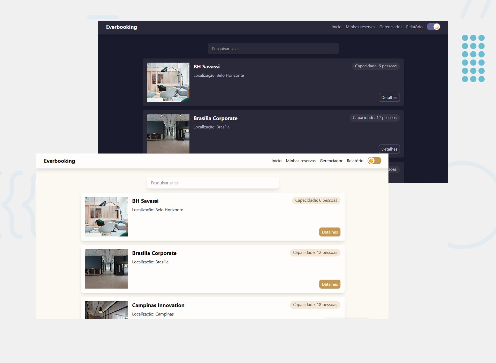

# Everbooking

Projeto fullstack com Docker desenvolvido para praticar NextJS, Python e PostgreSQL.

## Sobre

Aplicação em React (NextJS) que consome uma API em Python (FastAPI) conectada em um banco de dados (PostgreSQL) e permite:

- realizar cadastro, reset de senha e login;
- efetuar agendamentos de salas;
- filtrar salas;
- visualizar detalhes de um agendamento;
- cancelar ou editar um agendamento;
- extrair um relatório dos agentamentos;
- gerenciar salas, agendamentos, localizações e usuários.

---

## Tecnologias

- NextJS
- TypeScript
- Tailwind
- Python
- FastAPI
- PostgreSQL
- Docker

---

## Preview

Link: https://github.com/wholetomy/everbooking




---

## O que aprendi

- Criar projeto fullstack com Docker
- Criar sistema de login com Python como backend
- Criação de endpoints com FastAPI
- Criação de banco de dados com PostgreSQL
- Sistema de rotas com NextJS
- Estilização "mobile first" com Tailwind
- Troca de temas entre light e dark mode com Tailwind
- Tipagem com Python

---

## Instalação

```bash
git clone https://github.com/wholetomy/everbooking

cd everbooking

docker compose up --build -d

```

Para acessar o Everbooking, utilize os 2 links abaixo:

Frontend: 
http://localhost:3000

Credenciais de administrador do frontend:

- E-mail: admin@admin.com

- Senha: admin

Backend: 
http://localhost:8000/docs

Para parar a aplicação, basta utilizar o comando abaixo:

```bash
docker compose down
```

---

## Melhorias futuras

- Testes unitários
- Novos temas
- Tela para ver mais fotos de uma sala
- Possibilidade de agendar uma sala para outro usuário

---

## Autor

Thomas Campanholi